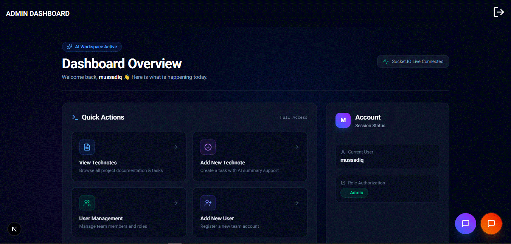
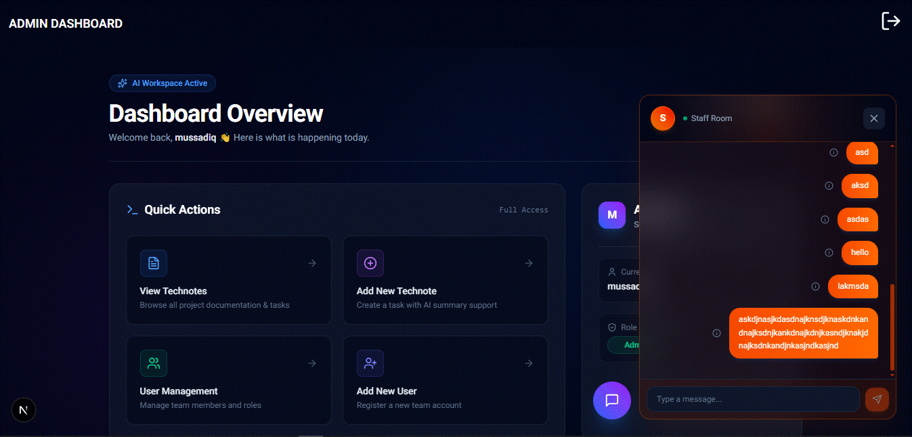
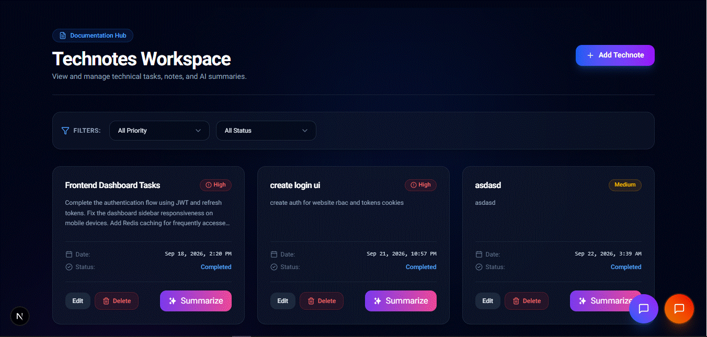
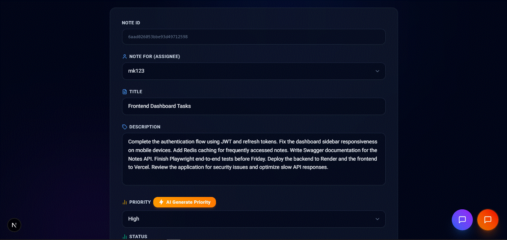

# TaskFlow AI

A full-stack task and collaboration platform where teams create tasks, assign work, chat in real time, and get AI assistance for summarizing and prioritizing notes.

I built this project to go deep on the parts of full-stack engineering that are easy to skip in tutorials: refresh-token authentication, role-based authorization, WebSocket-driven real-time features, caching strategy, AI API integration, and automated testing across the stack.

---

## Screenshots

### Dashboard



### CHAT



### NOTES



### PRIORITY



---

## Features

### 🔐 Authentication & Security
- JWT-based authentication with **access + refresh token rotation**
- Refresh tokens stored in **HTTP-only cookies** to reduce XSS exposure
- Passwords hashed with **bcrypt**
- Route-level and API-level **authorization middleware**
- Request validation with **Zod** on every mutating endpoint

### 🧑‍🤝‍🧑 Role-Based Access Control
Three roles, each with a distinct permission surface:

| Role | Permissions |
|---|---|
| **Admin** | Manage users, manage all tasks, access staff communication |
| **Manager** | Create/assign tasks, manage team tasks, access staff chat |
| **Employee** | View assigned tasks, update task status, chat with team |

Authorization isn't just hidden UI — it's enforced server-side on every route, so a restricted action fails at the API layer even if someone bypasses the frontend.

### ✅ Task & Notes Management
- Create, assign, and update tasks with priority levels (Low / Medium / High)
- Ownership rules: only the assigning manager/admin or the assignee can modify a task
- Role-based visibility — employees only see what's assigned to them
- Status tracking (Pending → In Progress → Completed)

### 🤖 AI Features (Google Gemini API)
- **AI Summary** — condenses a task's description into a short, readable summary
- **AI Priority Suggestions** — analyzes task content and suggests a priority level, which the user can accept or override

AI output is treated as a *suggestion*, not a source of truth — the human stays in control of the final task state, which mirrors how AI features are typically shipped in production.

### 💬 Real-Time Communication (Socket.IO)
- Real-time chat between team members
- Online/offline presence indicators
- Instant message delivery without polling
- Read receipts
- Real-time notifications pushed to connected clients

**Why WebSockets instead of just REST here:** normal API requests are pull-based — the client asks, the server answers. Chat, presence, and notifications are push-based — the server needs to tell connected clients something changed *the moment it happens*. Polling the REST API for that would mean constant, wasteful requests and noticeable lag. Socket.IO keeps a persistent connection open so the server can emit events (`message:new`, `user:online`, `notification:new`) directly to the right clients.

### ⚡ Redis Caching
- Caches frequently-read, rarely-changed data (e.g. task lists per user/role, user session lookups)
- Reduces repeated MongoDB reads under normal traffic patterns
- Cache invalidation is write-through: any create/update/delete on a cached resource explicitly busts the relevant cache key rather than relying on a TTL alone, so users don't see stale task data after an update
- TTLs are used as a safety net on top of explicit invalidation, in case an invalidation path is missed

### 🧪 Testing
- **Backend:** unit tests for business logic, API/integration tests with Supertest, an in-memory MongoDB instance (`mongodb-memory-server`) so tests don't touch a real database, and dedicated tests for the auth flow (login, refresh, protected route rejection)
- **Frontend:** component tests with Vitest + React Testing Library
- **End-to-end:** Playwright tests that drive the real browser through full user workflows (login → create task → assign → chat → log out)

---

## Technical Highlights

- **Token refresh flow implemented from scratch** — short-lived access tokens paired with a longer-lived refresh token in an HTTP-only cookie, with silent refresh on the client so users aren't logged out mid-session.
- **Authorization enforced server-side**, not just hidden in the UI — every protected route re-checks role and ownership.
- **Cache invalidation strategy** designed around correctness first (explicit busting on writes) with TTLs as a fallback, rather than trusting TTLs alone.
- **Typed end-to-end** — TypeScript on both frontend and backend, with Zod schemas validating data at the API boundary so runtime and compile-time types stay honest.
- **Real-time and REST coexist deliberately** — CRUD operations go through REST; anything that needs to reach another connected user instantly goes through Socket.IO.

---

## Architecture Overview

```
                ┌─────────────────┐
                │     Frontend     │
                │  Next.js 16 (App │
                │  Router) + React │
                └────────┬─────────┘
                         │  REST (HTTP) + WebSocket
                         ▼
                ┌─────────────────┐
                │   Express API    │
                │  + Socket.IO     │
                │  (auth, RBAC,    │
                │   validation)    │
                └───┬─────────┬───┘
                    │         │
        ┌───────────┘         └───────────┐
        ▼                                 ▼
┌───────────────┐                ┌────────────────┐
│    MongoDB     │                │      Redis      │
│  (persistent   │                │   (cache layer) │
│     data)      │                └────────────────┘
└───────┬────────┘
        │
        ▼
┌────────────────┐
│   Gemini AI     │
│ (summaries +    │
│  priority sug.) │
└────────────────┘
```

**Layer responsibilities:**
- **Frontend (Next.js):** renders UI, manages client state with React Query, opens a Socket.IO connection for live updates.
- **Express API:** the single entry point for all business logic — authentication, RBAC, validation, and orchestrating calls to MongoDB, Redis, and Gemini.
- **Socket.IO (server):** runs alongside the Express app, handling chat, presence, and notification events over persistent connections.
- **MongoDB:** source of truth for users, tasks, and messages.
- **Redis:** short-lived cache in front of MongoDB for hot-path reads.
- **Gemini AI:** called on-demand from the backend when a user requests a summary or priority suggestion — never called directly from the client, so the API key stays server-side.

---

## Application Workflow

1. User registers/logs in → backend issues an access token (short-lived) and a refresh token (HTTP-only cookie).
2. Client attaches the access token to API requests; when it expires, the client silently calls the refresh endpoint.
3. Authenticated requests hit role-checked middleware before reaching a controller.
4. Task reads check Redis first; on a miss, MongoDB is queried and the result is cached.
5. Task writes update MongoDB and invalidate the relevant cache key(s).
6. Chat messages and notifications are emitted over Socket.IO to connected clients in the relevant room/user channel.
7. AI summary/priority requests are proxied through the backend to the Gemini API and the result is returned to the client (not cached, since it's generated per request).

---

## Tech Stack

**Frontend**
- Next.js 16 (App Router), React 19, TypeScript
- Tailwind CSS v4
- TanStack React Query
- Socket.IO Client
- React Markdown
- Sonner (toasts)
- Lucide Icons

**Backend**
- Node.js, Express 5, TypeScript
- MongoDB + Mongoose
- Redis
- Socket.IO
- JWT authentication, bcrypt
- Zod validation
- Cloudinary (media uploads)

**AI**
- Google Gemini API

**Testing**
- Backend: Vitest, Supertest, MongoDB Memory Server
- Frontend: Vitest, React Testing Library
- E2E: Playwright

**Documentation**
- Swagger / OpenAPI

---

## Project Structure

```
TaskFlow_AI/
├── backend/
│   ├── src/
│   │   ├── controllers/
│   │   ├── models/         # mongoose schemas
│   │   ├── routes/
│   │   ├── middleware/      # auth, RBAC, validation, api limiter
│   │   ├── services/        # AI
│   │   ├── config/
│   │   ├── socket/
│   │   ├── schemas/         # zod validations
│   │   └── lib/
│   └── __tests__/
├── frontend/
│   ├── src/
│   │   ├── app/              # Next.js App Router pages
│   │   ├── components/
│   │   ├── lib/
│   │   ├── hooks/
│   │   ├── socket/           # client socket
│   │   └── server/           # server actions / API calls
│   └── __tests__/
└── e2e/
    └── tests/                # Playwright specs
```

---

## Installation

```bash
# Clone the repository
git clone https://github.com/mussadiqkhan6886/TaskFlow_AI.git
cd TaskFlow_AI

# Install backend dependencies
cd backend
npm install

# Install frontend dependencies
cd ../frontend
npm install
```

## Environment Variables

**backend/.env**
```env
PORT=4000
MONGODB_URI=your_mongodb_connection_string
REDIS_PASSWORD=redis_password
REDIS_HOST=redis_host
REDIS_PORT=redis_port
ACCESS_TOKEN=your_access_token_secret
REFRESH_TOKEN=your_refresh_token_secret
GEMINI_AI_API_KEY=your_gemini_api_key
FRONTEND_URL=http://localhost:3000
BACKEND_URL=http://localhost:4000
```

**frontend/.env**
```env
NEXT_PUBLIC_BASE_URL=http://localhost:4000
ACCESS_TOKEN=your_same_access_token
```

## Running the Project

```bash
# Start the backend (from /backend)
npm run dev

# Start the frontend (from /frontend)
npm run dev
```

The frontend runs on `http://localhost:3000` and the backend on `http://localhost:4000` by default. API documentation is available via Swagger UI once the backend is running.

## Testing

```bash
# Backend unit + API tests
cd backend
npm run test

# Frontend component tests
cd frontend
npm run test

# End-to-end tests (Playwright)
cd e2e
npx playwright test
```

---

## Engineering Concepts Demonstrated

- Full-stack architecture and separation of concerns between frontend, API, and data layers
- REST API design with resource-based routing and consistent response shapes
- Authentication systems (access/refresh token flow, HTTP-only cookies)
- Role-based access control (RBAC) enforced at the middleware level
- Real-time communication with WebSockets (Socket.IO)
- Caching strategy with Redis, including invalidation logic
- Third-party AI API integration (Google Gemini)
- Database modeling with Mongoose/MongoDB
- Automated testing across unit, integration, and end-to-end layers
- Type-safe development with TypeScript and runtime validation with Zod

---

## Future Improvements

- Add pagination and infinite scroll for task and message lists
- Add file attachments to tasks via Cloudinary
- Expand E2E coverage to multi-user real-time scenarios (two browser contexts chatting simultaneously)
- CI pipeline (GitHub Actions) running lint, unit, and E2E tests on every PR

---

## Author

**Mussadiq Khan**
GitHub: [@mussadiqkhan6886](https://github.com/mussadiqkhan6886)

---

### A note on this project

TaskFlow AI isn't trying to be a polished product — it's a project built to practice and demonstrate the engineering decisions that come up in real full-stack systems: how to handle auth safely, when to reach for WebSockets vs. REST, where caching actually helps, and how to keep a growing codebase typed and tested.